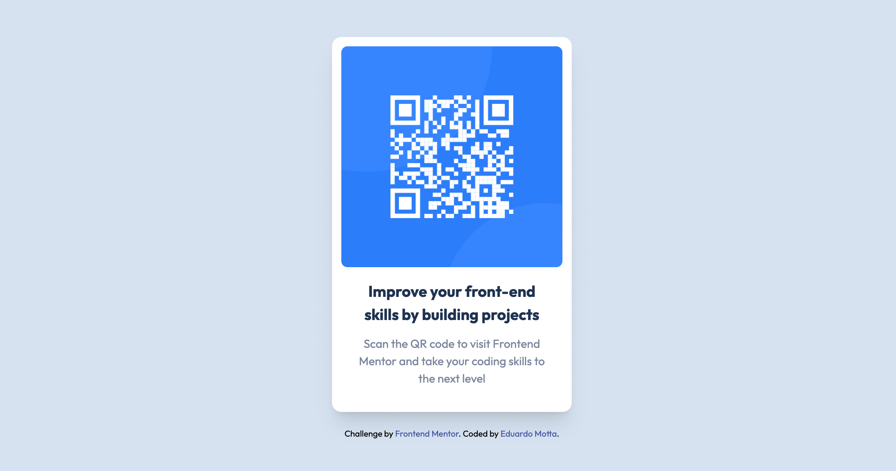

# Frontend Mentor - QR code component solution

This is a solution to the [QR code component challenge on Frontend Mentor](https://www.frontendmentor.io/challenges/qr-code-component-iux_sIO_H).

## Table of contents

- [Overview](#overview)
  - [Screenshot](#screenshot)
  - [Links](#links)
- [My process](#my-process)
  - [Built with](#built-with)
- [Author](#author)

## Overview

### Screenshot

### Links

- Solution URL: [https://www.frontendmentor.io/solutions/qr-code-using-tailwind-css-XeXspeJy2p](https://www.frontendmentor.io/solutions/qr-code-using-tailwind-css-XeXspeJy2p)
- Live Site URL: [https://e-motta.github.io/frontendmentor-qr-code-component/](https://e-motta.github.io/frontendmentor-qr-code-component/)

## My process

### Built with

- Semantic HTML5 markup
- Tailwind CSS

## Author

- Website - [https://eduardomotta.dev/](https://eduardomotta.dev/)
- Frontend Mentor - [@e-motta](https://www.frontendmentor.io/profile/e-motta)
